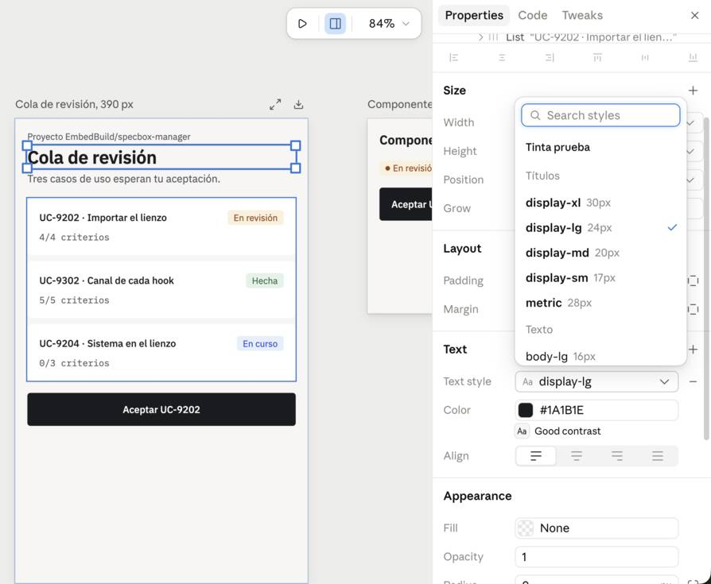
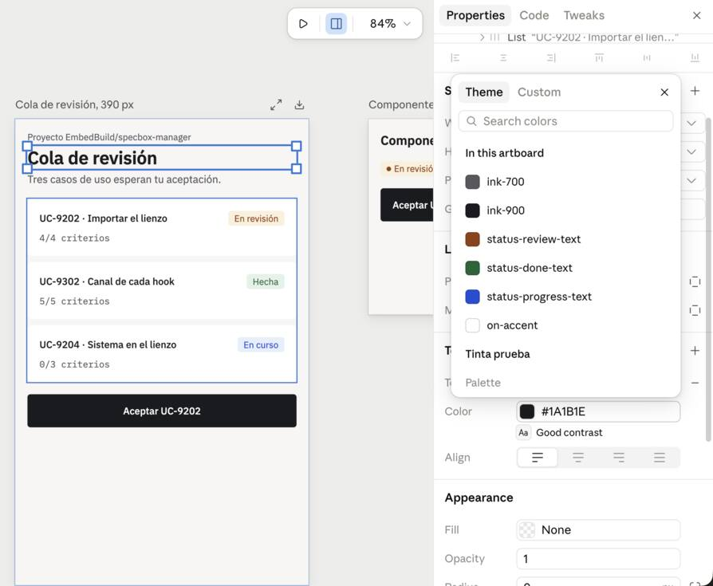

# El sistema del proyecto dentro de un lienzo de Claude Design (UC-9204)

> Fecha: 2026-10-10 · Claude Code 2.1.288 · tipos Design (release `1791586906-56be`) y Design System
> (release `1791558544-c1cf`).
> La prueba se hizo con un sistema y un lienzo de prueba, privados, en la cuenta del owner. El sistema
> salió de los tokens de Tinta (`tests/fixtures/design_system/tinta.design-system.tokens.json`) y de
> dos componentes compilados con esbuild.

## Por qué hacía falta

En la prueba del 2026-10-09, el lienzo con el sistema de embed.build tuvo que declarar a mano, en cada
artboard, las 52 variables que usa la hoja del sistema. El `bundle.css` de embed.build dice que sus
valores salen de un `tokens.css` que el sistema no publica, y la página del tipo solo genera ese fichero
cuando alguien guarda una edición en ella. El sistema de SpecBox sí funciona tal cual, porque su
`bundle.css` (compilado con Tailwind) declara sus variables.

## Lo que publica `/visual-setup` ahora

`ds-artifact.mjs build` deja en `project/`:

| Fichero | Qué lleva |
|---|---|
| `tokens.json` | Los tokens validados contra la gramática del tipo. Con Tinta no se cae ninguno |
| `tokens.css` | Variables del primer tema en `:root, [data-theme="light"]`, las del oscuro en `[data-theme="dark"]`, los demás tokens en `:root` y una clase por estilo de texto. La primera línea, `/* <título> — generated from tokens.json */`, es la que la página reconoce para regenerarlo |
| `components/bundle.css` | `@import` de Google Fonts con los pesos que usan los estilos, y la hoja de los componentes |
| `components/bundle.js` | El script clásico de esbuild (`--format=iife --global-name=<Ns>`, React como global) con su cabecera `@ds-bundle` |
| `components/<Comp>/README.md` · `preview.html` | Las props de cada componente, leídas de su interfaz en los tipos, y una vista previa |
| `README.md` | Tablas que nombran tokens, «Lo que se rehúsa» del DESIGN.md y «Consuming this system» |
| `components/Cover/preview.html` · `design-system.json` | La portada y el índice |

El servidor acepta publicar `tokens.css`. Cuando la página del sistema se abre, vuelve a guardar el
índice (`design-system.json`, con las claves ordenadas), pero no toca `tokens.css`.

## AC-01: el lienzo pinta con los valores del sistema sin declarar variables

El lienzo instala el sistema como dice la guía del tipo Design:
- copias en el servidor de `tokens.json`, `tokens.css` y `components/bundle.css`;
- su registro en `designSystems`.

El artboard enlaza `ds/tintaprueba/tokens.css` y `components/bundle.css`, y su `<helmet>` solo lleva
`body{margin:0}`. Congelado con `/design-review import` y abierto sin red ni JavaScript, sus estilos
calculados son los de los tokens:

| Elemento | Calculado | Token |
|---|---|---|
| Fondo y texto | `#f7f6f4` / `#1a1b1e` | `paper-000` / `ink-900` |
| Título | 24/30 px, 600, IBM Plex Sans, −0,01em | clase `display-lg` |
| Tarjeta | `#ffffff`, radio 6 px | `paper-100`, `radius-md` |
| Chip «En revisión» | `#fbf0dc` / `#92400e` | `status-review-bg` / `status-review-text` |
| Botón | `#1a1b1e` / `#ffffff`, 13 px 500 | `accent` (alias de `ink-900`) / `on-accent`, clase `label` |
| Dato | IBM Plex Mono 12 px | clase `data-sm` |
| Tipografías cargadas | IBM Plex Sans 400/500/600 e IBM Plex Mono 400 | — |

En el editor del lienzo, con el título del artboard seleccionado (comprobado por el owner a las 19:00):

- **Estilos de texto:** el desplegable «Text style» marca `display-lg` como el actual y ofrece los del
  sistema bajo «Tinta prueba», agrupados como en los tokens («Títulos»: `display-xl` 30px,
  `display-lg` 24px…; «Texto»: `body-lg` 16px…).
- **Colores:** la pestaña «Theme» del selector enseña, por su nombre de token, los colores usados en el
  artboard (`ink-700`, `ink-900`, `status-review-text`, `status-done-text`, `status-progress-text`,
  `on-accent`) y la paleta «Tinta prueba».

## AC-02: el lienzo monta los componentes compilados

Con `Button` y `StatusBadge` compilados con esbuild y publicados en el sistema, un segundo artboard
monta `<x-import component-from-global-scope="TintaPrueba.StatusBadge" status="review">` y
`TintaPrueba.Button`. Congelado, el DOM ya no tiene `<x-import>`, sino los componentes reales, con sus
clases y los colores de los tokens:
- `tp-badge--review` sale en `#fbf0dc` / `#92400e`;
- `tp-btn--primary` sale en `#1a1b1e` / `#ffffff`, con 44 px de alto;
- `tp-btn--secondary` lleva su borde de `line-300`.

## AC-03: ¿sirve el camino de `DesignSync`?

**No sirve para el lienzo.** Prueba real del 2026-10-10 con `/design-sync`, arrancado por el owner, y
solo con lecturas (no se creó ni se subió nada):

| Comprobación | Resultado |
|---|---|
| `DesignSync list_projects` | 6 proyectos de sistema de diseño de la cuenta del owner, sincronizados con `DesignSync` entre junio y septiembre de 2026 |
| `DesignSync get_project` + `list_files` (el más reciente) | `PROJECT_TYPE_DESIGN_SYSTEM`, sincronizado entero: `_ds_bundle.js`, `styles.css`, `tokens/tokens.css`, tipografías, `_ds_manifest.json` y 80 tarjetas de componentes |
| `Artifact list` del tipo Design System, `scope: "all"` | 3 sistemas, todos Artifact (embed.build, SpecBox, Tinta prueba). **Ninguno de los 6 proyectos aparece** |
| `Artifact` con el identificador del proyecto (`claude.ai/code/artifact/<uuid>`) | «artifact not found»: un proyecto de claude.ai/design no es un Artifact |

Un lienzo instala un sistema copiando los ficheros de un Artifact del tipo Design System:
- su dirección tiene que ser `https://claude.ai/artifact/<id>`;
- el editor ofrece los sistemas que da ese listado.

Un proyecto sincronizado con `DesignSync` no entra por ningún lado: sirve al diseñador de
claude.ai/design, no a los lienzos.

**Decisión.** `/visual-setup` publica el sistema del proyecto como Artifact del tipo Design System (Paso
2.9.3). `DesignSync` deja de ser la forma de llevar el sistema al lienzo y deja de ser precondición de
`/plan`. Queda para quien diseñe directamente en claude.ai/design.
