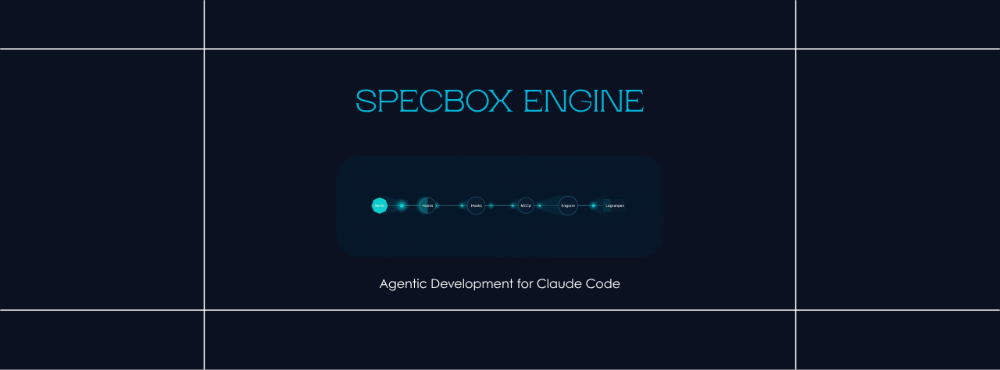
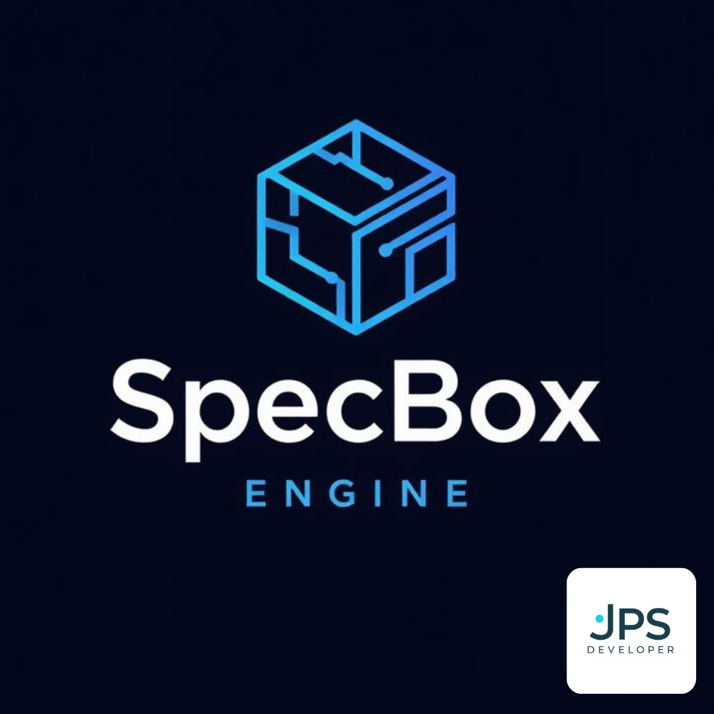

<p align="center">
  
</p>

<p align="center">
  
</p>

<h1 align="center">SpecBox Engine</h1>
<p align="center"><strong>Desarrollo Agéntico para Claude Code</strong></p>

<p align="center">
  <a href="https://marketplace.visualstudio.com/items?itemName=EmbedBuild.specbox-engine"></a>
  <a href="https://marketplace.visualstudio.com/items?itemName=EmbedBuild.specbox-engine"></a>
  <a href="https://marketplace.visualstudio.com/items?itemName=EmbedBuild.specbox-engine"></a>
  
  
  
  
</p>

<p align="center">
  <a href="README.md">English</a> · <strong>Español</strong>
</p>

<p align="center">
  Configuración en un clic del sistema agéntico SpecBox Engine.<br/>
  Skills, hooks, servidores MCP y memoria Engram — multiplataforma, sin configuración manual.
</p>

---

## ¿Por qué SpecBox Engine?

Claude Code es potente de serie. SpecBox Engine lo convierte en **sistemático**:

| Sin SpecBox | Con SpecBox |
|-------------|-------------|
| Código ad-hoc, sin estructura | Spec-driven: pipeline US → UC → AC |
| Sin gates de calidad | 20+ hooks: leer-antes-de-escribir, branch guards, lint gates |
| Contexto perdido entre sesiones | Memoria persistente Engram guarda decisiones y descubrimientos |
| Gestión manual de proyecto | Integración con Trello/Plane/FreeForm + 110+ tools MCP |
| Sin acceptance testing | Motor BDD de aceptación con reports HTML como evidencia |

---

## Funcionalidades

La extensión expone 5 comandos en la Paleta de Comandos (`Ctrl+Shift+P` / `Cmd+Shift+P`):

| Comando | Qué hace |
|---------|----------|
| **SpecBox: Instalar Engine** | Instalación en un clic de 15 skills, 20+ hooks, settings y servidores MCP |
| **SpecBox: Comprobar Salud** | Diagnóstico (Node, Claude Code, Engram, skills, hooks, MCP) |
| **SpecBox: Inicializar Proyecto** | Asistente interactivo que te guía paso a paso |
| **SpecBox: Ver Estado** | Vista rápida del estado del engine en el workspace actual |
| **SpecBox: Configurar Servidores MCP** | Configura o repara los servidores MCP de SpecBox + Engram |

Más un **panel lateral** con vistas `Estado` y `Skills`, y un **indicador en la barra de estado** que muestra la salud del engine de un vistazo.


---

## Inicio rápido

### 1. Instala la extensión

Busca **"SpecBox Engine"** en el Marketplace de VSCode, o ejecuta:

```bash
code --install-extension EmbedBuild.specbox-engine
```

### 2. Elige tu modo en la primera activación

En la primera activación dentro de un workspace, la extensión muestra una
notificación con dos opciones (una sola vez):

- **Iniciar sesión con GitHub** — abre el navegador, completa el flujo
  OAuth de GitHub a través de [cloud.specbox.build](https://cloud.specbox.build)
  y guarda el token MCP resultante en el llavero del sistema operativo
  mediante VSCode SecretStorage. Activa el backend Native (tracking
  compartido, reservas multi-developer).
- **Continuar en modo local (FreeForm)** — sin auth, sin nube. Todo el
  tracking vive en disco bajo `doc/tracking/`. Mira la sección
  [Modo local (sin auth)](#modo-local-sin-auth) más abajo.

Puedes cambiar de modo en cualquier momento: `Ctrl+Shift+P` → **SpecBox:
Iniciar sesión con GitHub** o **SpecBox: Cerrar sesión**.

### 3. Ejecuta el asistente de inicialización

`Ctrl+Shift+P` → **SpecBox: Inicializar Proyecto**

El asistente se encarga de todo:

```
Paso 1  →  Comprueba requisitos (Node, Claude Code, Engram)
Paso 2  →  Localiza el repo del engine (autodetectado o clonado)
Paso 3  →  Instala todos los skills + 20+ hooks + settings
Paso 4  →  Configura servidores MCP (SpecBox + Engram)
```

### 4. Empieza a construir

```
/prd "Autenticación de usuario con OAuth2"  → Requisitos
/plan PROYECTO-42                            → Plan técnico + diseños UI
/implement auth_plan                         → Implementación autopilot
```

---

## Modo local (sin auth)

FreeForm sigue siendo **first-class**. Si eliges "Continuar en modo local"
obtienes el engine completo — skills, hooks, acceptance BDD, tools MCP
que no requieren estado compartido — sin abrir nunca un navegador ni
guardar ningún token.

Lo que funciona sin iniciar sesión:
- El pipeline completo: `/prd`, `/plan`, `/implement`, `/audit`, etc.
- Backends Trello y Plane (con sus propias API keys).
- Todas las tools no-Native (110+ tools).

Lo que requiere iniciar sesión:
- El sistema de reservas de UC del backend Native (locking multi-developer).
- Las cuatro tools nativas: `whoami`, `reserve_uc`, `release_uc`,
  `register_native_branch`.

Consulta [doc/runbooks/freeform-only-mode.md](https://github.com/EmbedBuild/specbox-engine/blob/main/doc/runbooks/freeform-only-mode.md)
para una guía detallada.

---

## Cómo funciona el inicio de sesión por dentro

1. Pulsas **Iniciar sesión con GitHub**. La extensión arranca un servidor
   HTTP one-shot en `127.0.0.1` (puerto aleatorio asignado por el sistema),
   genera un state CSRF de 64 hex y abre
   `https://cloud.specbox.build/vscode/issue-token` en tu navegador por
   defecto, pasando la URL del loopback y el state como query params.
2. La nube gestiona el baile OAuth de GitHub (las credenciales en plano
   no tocan nunca la extensión ni el engine — solo la nube).
3. La nube redirige al loopback con `?mcp_token=spbx_<base64url>&state=<csrf>`. El shape del token es la salida de `issueMcpToken()` del cloud — prefijo `spbx_` + cuerpo base64url, espejo del algoritmo `register_mcp_token` del engine.
4. La extensión valida el state, comprueba el regex del token, lo persiste
   en **VSCode SecretStorage** (Keychain en macOS, Credential Manager en
   Windows, libsecret en Linux) y le pide a Claude Code que reinicie el
   servidor MCP para que el token entre en scope.
5. Si el token se **revoca** en la nube, el engine devuelve
   `UNAUTHENTICATED` en la siguiente llamada a una tool nativa (≤30s
   gracias al cache TTL del servidor). El sidebar hace polling cada 60s y
   se actualiza solo — visibilidad total del revoke ≤90s.

La parte de la nube se implementa en [`EmbedBuild/specbox_cloud`](https://github.com/EmbedBuild/specbox_cloud)
(US-09). Consulta [doc/decisions/native_default_oauth.md](https://github.com/EmbedBuild/specbox-engine/blob/main/doc/decisions/native_default_oauth.md)
para el rationale arquitectural y los trade-offs de seguridad residuales.

---

## Requisitos

- **Claude Code** — [instalar](https://claude.ai/code) o la extensión oficial de Claude para VSCode.
- **Node.js 18+** — [descargar](https://nodejs.org)
- **Git** — [descargar](https://git-scm.com)
- **VSCode 1.86+** — requerido para localización runtime (`vscode.l10n`).

---

## Qué se instala

### 15 Agent Skills

| Skill | Qué hace |
|-------|----------|
| `/prd` | Genera Product Requirements Documents |
| `/plan` | Planes técnicos + diseños UI con Stitch |
| `/implement` | Implementación autopilot end-to-end con gates de calidad |
| `/feedback` | Captura feedback de testing como evidencia |
| `/quality-gate` | Comprobaciones adaptativas de calidad antes de PR |
| `/explore` | Análisis read-only del código base |
| `/visual-setup` | Configuración de brand kit + design system |
| `/adapt-ui` | Escanea y mapea componentes UI del proyecto |
| `/optimize-agents` | Auditoría y optimización de la configuración agéntica |
| `/acceptance-check` | Validación BDD de aceptación independiente |
| `/check-designs` | Compliance retroactivo de diseños Stitch |
| `/quickstart` | Tutorial interactivo para usuarios nuevos |
| `/audit` | Auditoría de calidad ISO/IEC 25010 a demanda |
| `/release` | Auditoría de versión, changelog y publish |
| `/compliance` | Auditoría completa de compliance SpecBox |

### 20+ Hooks de calidad

Enforcement automático — Claude Code sigue las reglas sin que se lo recuerdes:

| Hook | Qué evita |
|------|-----------|
| **quality-first-guard** | Modificar un archivo sin haberlo leído antes |
| **spec-guard** | Escribir código sin un Use Case activo |
| **branch-guard** | Escribir código directamente en main/master |
| **no-bypass-guard** | Usar `--no-verify`, `push --force`, `reset --hard` |
| **healing-budget-guard** | Bucles infinitos de healing (límite duro 8 intentos) |
| **pipeline-phase-guard** | Ejecución fuera de orden (p.ej. código de feature antes de DB) |
| **design-gate** | Crear páginas UI sin diseños Stitch |
| **e2e-gate** | Commitear evidencia de aceptación sin reports válidos |

### 2 Servidores MCP

| Servidor | Tools | Propósito |
|----------|-------|-----------|
| **SpecBox Engine** | 110+ | Plans, calidad, features, telemetría, spec-driven, proxy Stitch |
| **Engram** | 6 | Memoria persistente entre sesiones y compactaciones de contexto |

---

## Configuración

| Setting | Por defecto | Descripción |
|---------|-------------|-------------|
| `specbox.enginePath` | _(autodetectado)_ | Ruta al repo de SpecBox Engine |
| `specbox.autoHealthCheck` | `true` | Comprobar salud al arrancar |
| `specbox.mcpAutoStart` | `true` | Configurar MCP automáticamente al instalar |

---

## Idiomas

La interfaz de la extensión y el listing del Marketplace están disponibles en:

- 🇺🇸 **Inglés** (por defecto, canónico)
- 🇪🇸 **Español** (España, neutral)

VSCode resuelve el idioma automáticamente según `vscode.env.language`. Para forzar un locale, arranca VSCode con `code --locale=es` o `code --locale=en`.

---

## Multiplataforma

| Funcionalidad | macOS | Linux | Windows |
|---------------|-------|-------|---------|
| Instalación de skills | Symlinks | Symlinks | Copia (auto-fallback) |
| Instalación de hooks | Copia | Copia | Copia |
| Configuración MCP | Config JSON | Config JSON | Config JSON |
| Merge de settings | Smart merge | Smart merge | Smart merge |
| Instalación de Engram | Homebrew | Homebrew | Binario manual |

La extensión usa symlinks cuando es posible, con fallback automático a copia en Windows.

---

## Solución de problemas

| Problema | Solución |
|----------|----------|
| "Claude Code no detectado" | Instala primero [Claude Code](https://claude.ai/code) o la extensión Claude para VSCode. |
| Servidores MCP inalcanzables | Ejecuta **SpecBox: Configurar Servidores MCP** para reescribir la config MCP. El servidor MCP de SpecBox usa un endpoint hospedado gratuito — verifica el acceso a la red y que `npx` esté en el `PATH`. |
| Aviso de versión del engine no coincide | La extensión y el repo local del engine están desincronizados. Ejecuta **SpecBox: Instalar Engine** para actualizar los archivos locales, o `git pull` en el repo del engine. |
| Los comandos salen en inglés aun con `--locale=es` | Recarga la ventana después de instalar (`Ctrl+Shift+P` → "Developer: Reload Window"). VSCode cachea los bundles NLS entre sesiones. |
| El walkthrough no aparece | Ejecuta **SpecBox: Inicializar Proyecto** manualmente. El walkthrough solo se lanza automáticamente en la primera instalación. |

Para cualquier otro problema, [abre una issue en GitHub](https://github.com/EmbedBuild/specbox-engine/issues).

---

## Alternativa por terminal

Para entornos CI/CD o headless (solo macOS/Linux):

```bash
git clone https://github.com/EmbedBuild/specbox-engine.git ~/specbox-engine
cd ~/specbox-engine && ./install.sh
```

Nota: `install.sh` no configura los servidores MCP. Mira la [guía Getting Started](https://github.com/EmbedBuild/specbox-engine/blob/main/docs/getting-started.md) para configurarlos manualmente.

---

<p align="center">
  <strong>SpecBox Engine by JPS</strong><br/>
  <sub>Sistema de programación agéntica para Claude Code</sub><br/>
  <a href="https://github.com/EmbedBuild/specbox-engine">GitHub</a> · <a href="https://github.com/EmbedBuild/specbox-engine/blob/main/docs/getting-started.md">Docs</a> · <a href="https://github.com/EmbedBuild/specbox-engine/issues">Issues</a> · <a href="CHANGELOG.md">Changelog</a>
</p>
