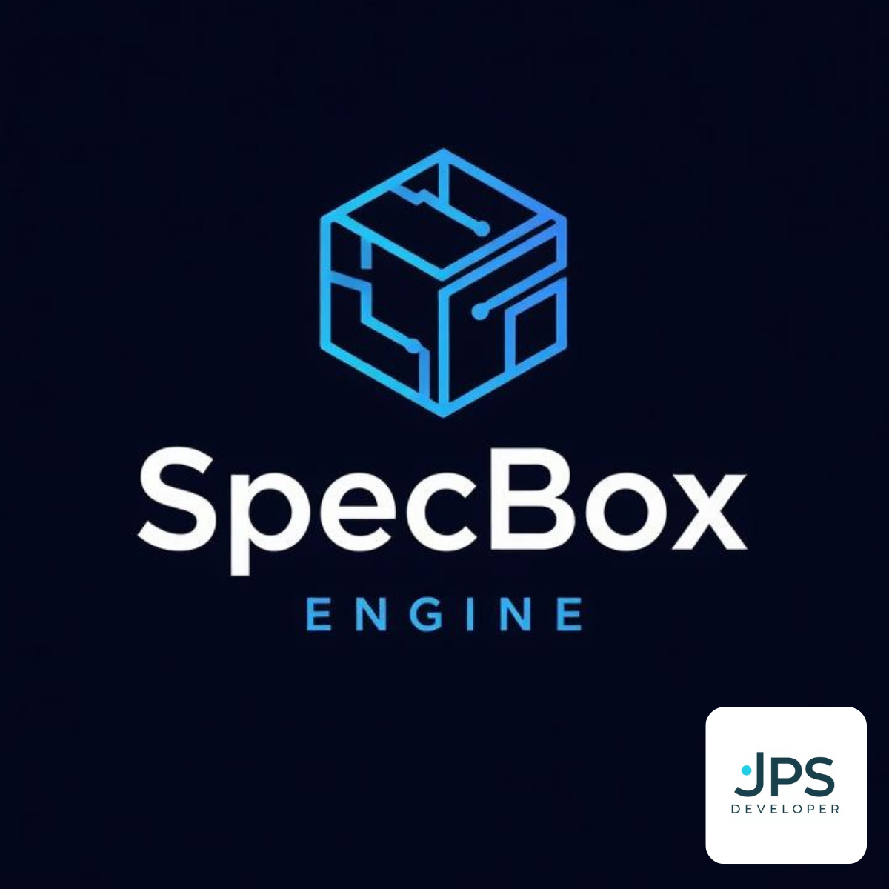

<p align="center">
  
</p>

<p align="center">
  
</p>

<h1 align="center">SpecBox Engine</h1>
<p align="center"><strong>Agentic Dev for Claude Code</strong></p>

<p align="center">
  <a href="https://marketplace.visualstudio.com/items?itemName=jpsdeveloper.specbox-engine"></a>
  <a href="https://marketplace.visualstudio.com/items?itemName=jpsdeveloper.specbox-engine"></a>
  
  
</p>

<p align="center">
  One-click setup for the SpecBox Engine agentic programming system.<br/>
  Skills, hooks, MCP servers, and Engram memory — cross-platform, zero config.
</p>

---

## Why SpecBox Engine?

Claude Code is powerful out of the box. SpecBox Engine makes it **systematic**:

| Without SpecBox | With SpecBox |
|----------------|-------------|
| Ad-hoc coding, no structure | Spec-driven: US → UC → AC pipeline |
| No quality enforcement | 20+ hooks: read-before-write, branch guards, lint gates |
| Context lost between sessions | Engram persistent memory saves decisions & discoveries |
| Manual project management | Trello/Plane/FreeForm integration with 110 MCP tools |
| No acceptance testing | BDD acceptance engine with HTML evidence reports |

## Quick Start

### 1. Install the extension
Search **"SpecBox Engine"** in VSCode marketplace, or:
```
code --install-extension jpsdeveloper.specbox-engine
```

### 2. Run the onboarding wizard
`Ctrl+Shift+P` → **SpecBox: Onboard Project**

The wizard handles everything:

```
Step 1  →  Check prerequisites (Node, Python, Claude Code, Engram)
Step 2  →  Locate engine repo (auto-detect or clone)
Step 3  →  Install 15 skills + 20 hooks + settings
Step 4  →  Configure MCP servers (SpecBox + Engram)
```

### 3. Start building
```
/prd "User authentication with OAuth2"     → Requirements
/plan PROJECT-42                            → Technical plan + UI designs
/implement auth_plan                        → Autopilot implementation
```

---

## What Gets Installed

### 15 Agent Skills

| Skill | What it does |
|-------|-------------|
| `/prd` | Generate Product Requirements Documents |
| `/plan` | Technical plans + Stitch UI designs |
| `/implement` | End-to-end autopilot with quality gates |
| `/feedback` | Capture testing feedback as evidence |
| `/quality-gate` | Adaptive quality checks before PR |
| `/explore` | Read-only codebase analysis |
| `/visual-setup` | Brand kit + design system configuration |
| `/adapt-ui` | Scan and map project UI components |
| `/optimize-agents` | Audit and optimize agent configuration |
| `/acceptance-check` | Standalone BDD acceptance validation |
| `/check-designs` | Retroactive Stitch design compliance |
| `/quickstart` | Interactive tutorial for new users |
| `/remote` | Remote project management |
| `/release` | Version audit, changelog, and publish |
| `/compliance` | Full SpecBox compliance audit |

### 20+ Quality Hooks

Automatic enforcement — Claude Code follows the rules without being told:

| Hook | What it prevents |
|------|-----------------|
| **quality-first-guard** | Modifying a file without reading it first |
| **spec-guard** | Writing code without an active Use Case |
| **branch-guard** | Writing code directly on main/master |
| **no-bypass-guard** | Using `--no-verify`, `push --force`, `reset --hard` |
| **healing-budget-guard** | Infinite healing loops (hard limit at 8 attempts) |
| **pipeline-phase-guard** | Out-of-order execution (e.g., feature code before DB) |
| **design-gate** | Creating UI pages without Stitch designs |
| **e2e-gate** | Committing acceptance evidence without valid reports |

### 2 MCP Servers

| Server | Tools | Purpose |
|--------|-------|---------|
| **SpecBox Engine** | 110 | Plans, quality, features, telemetry, spec-driven, Stitch proxy |
| **Engram** | 6 | Persistent memory across sessions and context compactions |

---

## Extension Features

### Status Bar
Always visible — shows engine version and health at a glance.

`$(check) SpecBox v5.21.0` — all systems operational

`$(alert) SpecBox v5.21.0` — click to see what needs attention

### Sidebar Panel
Activity bar icon with two views:
- **Status** — live health of 10 components (Node, Python, Claude Code, Engram, skills, hooks, MCP...)
- **Skills** — all 15 skills with descriptions and install status

### Health Check
Run `SpecBox: Health Check` anytime to get a full diagnostic report:

| Component | What it checks |
|-----------|---------------|
| Node.js | Installed and version |
| Python | 3.12+ required for MCP server |
| Claude Code | CLI available |
| Engram | Memory system installed |
| Skills | 15/15 installed |
| Hooks | 20+ active |
| MCP SpecBox | Server configured |
| MCP Engram | Memory configured |

### Getting Started Walkthrough
Native VSCode walkthrough (appears on first install) that guides you through each setup step with explanations.

---

## Settings

| Setting | Default | Description |
|---------|---------|-------------|
| `specbox.enginePath` | _(auto-detect)_ | Path to the SpecBox Engine repo |
| `specbox.autoHealthCheck` | `true` | Check health on startup |
| `specbox.mcpAutoStart` | `true` | Auto-configure MCP on install |

---

## Commands

| Command | Shortcut |
|---------|----------|
| SpecBox: Install Engine | — |
| SpecBox: Health Check | — |
| SpecBox: Onboard Project | — |
| SpecBox: Configure MCP Servers | — |
| SpecBox: Show Status | — |
| SpecBox: Open Sala de Maquinas | — |

---

## Requirements

- **Claude Code** — [install](https://claude.ai/code)
- **Node.js 18+** — [download](https://nodejs.org)
- **Python 3.12+** — [download](https://python.org)
- **Git** — [download](https://git-scm.com)

---

## Cross-Platform

| Feature | macOS | Linux | Windows |
|---------|-------|-------|---------|
| Skills installation | Symlinks | Symlinks | Copy (auto-fallback) |
| Hooks installation | Copy | Copy | Copy |
| MCP configuration | JSON config | JSON config | JSON config |
| Settings merge | Smart merge | Smart merge | Smart merge |
| Engram install | pip/pipx | pip/pipx | pip/pipx |

The extension uses symlinks where possible, with automatic fallback to file copy on Windows (no admin/dev mode required).

---

## Terminal Alternative

For CI/CD or headless environments (macOS/Linux only):
```bash
git clone https://github.com/jpsdeveloper/specbox-engine.git ~/specbox-engine
cd ~/specbox-engine && ./install.sh
```

Note: `install.sh` does not configure MCP servers. See [Getting Started](https://github.com/jpsdeveloper/specbox-engine/blob/main/docs/getting-started.md) for manual MCP setup.

---

<p align="center">
  <strong>SpecBox Engine by JPS</strong><br/>
  <sub>Agentic programming system for Claude Code</sub><br/>
  <a href="https://github.com/jpsdeveloper/specbox-engine">GitHub</a> · <a href="https://github.com/jpsdeveloper/specbox-engine/blob/main/docs/getting-started.md">Docs</a> · <a href="https://github.com/jpsdeveloper/specbox-engine/issues">Issues</a>
</p>
